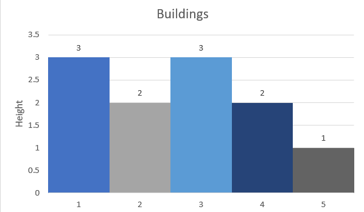
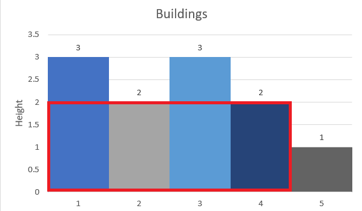
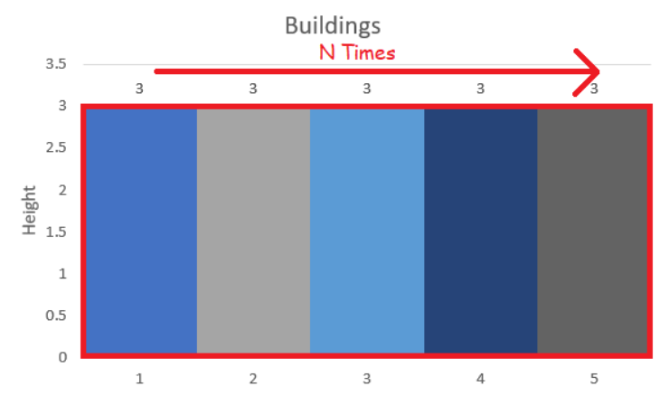
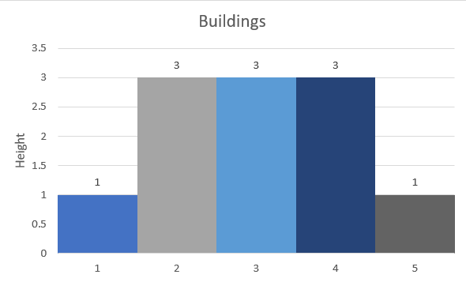
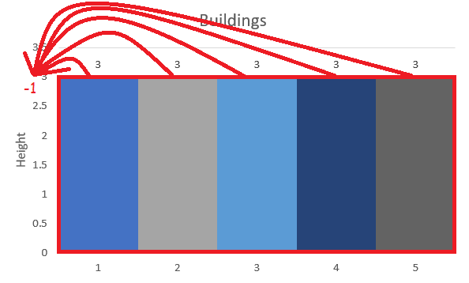
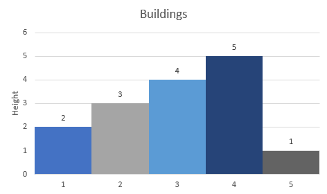
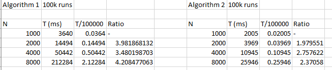
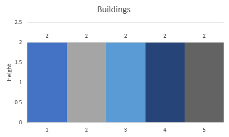
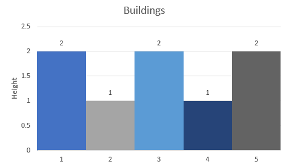

# CS5132 PA1 Report

## Explanation and analysis of algorithm

Let's assume all the buildings have a width of 1, since the width is constant.



Consider the third building in this example, with a height of 3. We can compute the area if we start from building 3 in this way:

- To the left, although there is another building with height 3 at position 1, we cannot put a flag there* since there is a building with height 2 in between
- To the right, there are no other buildings with height 3
- Thus, the maximum area if we start from building 3 is 3.

\* with height 3 anyway

Next, let's consider the 4th building with height 2.

- To the left, there are 3 buildings with height greater than or equal to 2. Thus, the left area is 2*3 = 6
- To the right, there are no buildings with height greater than or equal to 2. Thus, we cannot put any flags to the right.
- Thus, the maximum area is 2 + 6 = 8



In fact, this is the largest area for this example.


From this we can observe that

- We need to consider buildings to the left and to the right (and also the building itself)
- The process of considering buildings to the left and right is the same
  - Move along until there is a building with a shorter height
  - Find the distance between the current building and the next shorter building
  - The area in that direction is the distance * the height of the current building
- The total area is the sum of the left and right areas

<html><div style="page-break-after: always;"></div></html>

Thus, we can implement a simple algorithm as follows:

```java
// O(n^2) solution.
public static double getLargestArea(double[] arr, double width, int size) {
    double maxArea = 0;
    for (int i = 0; i < size; i++) {
        int currentNumberOfBuildings = 0;
        double currentHeight = arr[i];
        // Iterate over buildings from the current to the end
        for (int j = i; j < size; j++) {
            // Stop when the building height is less than the current height.
            // cannot put flag anymore
            if (arr[j] < currentHeight) {
                break;
            }
            currentNumberOfBuildings++;
        }
        // Iterate over buildings from the current to the front
        for (int j = i; j >= 0; j--) {
            // Stop when the building height is less than the current height.
            // cannot put flag anymore
            if (arr[j] < currentHeight) {
                break;
            }
            currentNumberOfBuildings++;
        }
        // -1 cos double counted current building
        double currentArea = currentHeight * (currentNumberOfBuildings - 1) * width;
        if (currentArea > maxArea) {
            maxArea = currentArea;
        }
    }
    return maxArea;
}
```

The worst case time complexity is $O(N^2)$. Consider this worst case scenario:



Since all the buildings have the same height, we would have to traverse all N buildings to try (and fail) to find a building with the smallest height. Since we do this for each of N buildings, the overall time complexity is $O(N^2)$​.​

<html><div style="page-break-after: always;"></div></html>

### Can we do better?

However, can we do better than a $O(N^2)$​ solution? Let's consider another example.



(This is the same as the previous worst case except the ends are shorter so we don't have to deal with literal edge cases)

For simplicity, let's just consider the area to the left of a building. (Finding the area to the right is very similar as noted previously)

If we used the previous algorithm, we would have to traverse til the edges to find a shorter building. However, we notice that after building number 2, the smallest building to the left is 1 with height 1. When we come to building 4, we have to pass through building 2 and 3 to get to building 1.

However, when we consider building 4, we notice that the **height of building 2 and 3 doesn't actually matter as long as it's not less than 3**. Additionally, they **will never** **matter** because **any building taller than 3 to the right of 4 will be blocked by building 4** before they even get to buildings 2 and 3.

In fact, we can compress them into a single building with width=2. Instead of doing this (since we don't want to deal with another array for building widths) we can instead keep track of the index of the last building that's smaller than the current building.

### Data structure choice

Since we are concerned with the buildings that are closest to the current building, using a **stack** makes sense.

As we traverse the buildings, we pop buildings that don't matter (2 and 3) off the top of the stack and replace (push) them with building 4, which is equivalent as shown above.

Now, we need to decide if we should store the building height, building index or both on the stack. At first, I thought we would need both, but I realised we could just store the building indexes and do an $O(1)$​​​ array lookup to get the height.

<html><div style="page-break-after: always;"></div></html>

### Final algorithm

This algorithm computes the left area (inclusive of the current building). We also assume the height of each building is 1.

Let n be the number of buildings, `arr[i]` be the height of building `i`
Initialize an `int` stack `minStack`
Initialize a double array `area` with `size = n`

```pseudocode
for index i, element height in arr:
    /* Index 0 refers to an actual building */
    let leftIndex = -1

    /* 	We now find the next smallest building
        we also 'compact' the stack by popping off all buildings
        that are larger than the current building
        and replace them with the current building
        (which is the limiting factor since it's smaller than the popped buildings 
        which are larger or similarly sized)
    */
    while minStack is not empty:
        /* found smaller building */
        if arr[minStack.peek()] < height:
            leftIndex = minStack
            break
        /* top of stack is larger than current, compact stack */
        minStack.pop()
    end loop

    /* complete stack compacting by replacing popped elements with current building */
    minStack.push(i)
    
    /* We can put flag on i-leftIndex buildings */
    area[i] = height * (i - leftIndex)
end loop

return max(area)
```

### How is this better?

Let's look at the previous worst case again:



When we get to building 1, there are no other buildings on the stack, so `leftIndex = -1`. We push building 1 on the stack.

Next, we go to building 2. We pop buildings on the stack until we get to a shorter building (which never happens). After we pop building 1, the stack is empty and  `leftIndex = -1`. We then push building 2 on the stack. This is exactly the same state as after processing building 1. Since the other buildings are identical, this repeats n times. 

Thus, the 'compact' stage of the algorithm allows us to (in this case) perform a constant number of operations per building, instead of an increasing number of operations as before.

### Time complexity analysis

Overall, we can prove that this algorithm runs in $O(n)$​​ time. We will show that the **total number** of times inner while loop is executed (over all the buildings) is at worst twice the number of buildings.

Consider the operation ` minStack.pop()`. Since buildings are only pushed onto the stack once, `minStack.pop()` can only be run `n` times.

Each time the while loop is executed, it either exits without popping, or it pops an element from the stack.

Consider the case where the pop operation is always executed. The loop will only run n times because only n elements are pushed on the stack. This is the case we discussed above.



Conversely, let's consider the case where the pop operation is never executed until the last building. This is the case when the smaller building is found immediately, thus no compacting is required. However, when the last building is processed, there is no smaller building, thus all the (n-1) buildings before it must be popped. Thus, the loop is executed 2n times overall in this case.

Since both cases execute in $O(n)$ time, the overall time complexity is $O(n)$.

### Putting everything together

The `leftArea` algorithm detailed in the previous sections is incomplete. We also need to consider the buildings to the right of the current building. Fortunately, it is extremely similar to `leftArea`, except that we start iteration from the right instead of the left. Since we are only allowed one stack, we pop all the elements off the stack as a 'cleanup' stage between the two stages. 

Since all the stages execute in $O(n)$ time and $O(n)$ space, the time and space complexity for the overall algorithm is $O(n)$​.

Since we need to visit all buildings to determine the largest area, this algorithm is the most efficient algorithm to solve this problem (in terms of big-O notation)

## Testing

### Empirical analysis



Each algorithm was run 100,000 times on a randomized array of length N. The time required for the algorithm to complete is shown above.

From the ratios between the runs, for algorithm 1, each time N is doubled, the time taken increases by 4x. This is characteristic of an $O(n^2)$ algorithm.

For algorithm 2, the ratio between doubled runs is approximately 2. This shows that the time required scales linearly with the input size. However, for N=4000, the ratio is quite a bit larger than 2. This could be due to the time required to reallocate memory to resize the stack being disproportionally large compared to the number of push and pop operations.

<html><div style="page-break-after: always;"></div></html>

### Interesting test cases



| Input                                        | Output |
| -------------------------------------------- | ------ |
| 5 1.0<br>2.0<br/>2.0<br/>2.0<br/>2.0<br/>2.0 | 10     |

All buildings have the same height. This could cause edge case error if we continue looking for a smaller building.

<html><div style="page-break-after: always;"></div></html>




| Input                                        | Output |
| -------------------------------------------- | ------ |
| 5 1.0<br>2.0<br/>1.0<br/>2.0<br/>1.0<br/>2.0 | 5      |

Output would be incorrect if the smaller buildings in between were ignored.

<html><div style="page-break-after: always;"></div></html>


| Input         | Output |
| ------------- | ------ |
| 1 1.0<br>10.0 | 10     |

There is only 1 building. Program could crash if it compares the height of the next building without checking the bounds of the array.

<html><div style="page-break-after: always;"></div></html>


| Input                                        | Output |
| -------------------------------------------- | ------ |
| 5 1.0<br>4.0<br/>2.0<br/>8.0<br/>4.0<br/>8.0 | 12     |

Program would output 8 if only the left area is considered. However, if it considers both left and right area, it would find that the left + right area for building 4 is 12.

<html><div style="page-break-after: always;"></div></html>


| Input                                        | Output |
| -------------------------------------------- | ------ |
| 5 1.0<br>2.0<br/>8.0<br/>8.0<br/>7.0<br/>1.0 | 21     |

Conversely, if we only consider the right area, the program would output 16 instead of 21 (7 * 3).

